# Veylix

  

  
  
  
  
  
  
  

VEYLIX is an AI-native spatial production system designed for generating, orchestrating, and deploying synthetic 3D assets across adaptive virtual environments and AAA world engines. 

Traditional 3D creation flows are heavily fragmented, depending on manual iteration loops, disconnected modeling tools, isolated file formats, and manual export scripts. VEYLIX consolidates this entire lifecycle into a single, high-fidelity spatial production layer. From concept frames and reference analysis to polygon topology resolution, material direction, rig orchestration, registry memory, and deployment routing, VEYLIX compresses virtual production into an automated, highly parallelized, agent-integrated pipeline.

## Production & Compute Pipeline

The VEYLIX compute pipeline dynamically allocates GPU core threads to ingest prompts or 2D concept frames, synthesize spatial geometry solvers, compile rigging weights, register metadata, and stream target-compatible assets directly to virtual runtimes.

```mermaid
flowchart LR
    A(["Creator / AI Agent"]) -->|Input Prompt or 2D Reference| B["VEYLIX Orchestrator"]

    subgraph OpenClaw ["OpenClaw Orchestration Layer"]
        C["REST / SDK / CLI Ingest"]
        D["Orchestration Coordinator"]
        E["GPU Compute Coordinator"]
    end

    B --> C
    C --> D
    D --> E

    subgraph Synthesis ["Spatial Compute Nodes"]
        F["Mesh Topology Solver"]
        G["Material & Shader Direction"]
        H["Rig Orchestration Node"]
    end

    E --> F
    F --> G
    G --> H

    subgraph Registry ["Persistent Spatial Registry"]
        I["Metadata Layer Allocation"]
        J["Asset Memory (IPFS / On-Chain)"]
    end

    H --> I
    I --> J

    subgraph Deployments ["Deployment Routing Targets"]
        K(["Unity Engine"])
        L(["Unreal Engine"])
        M(["WebGL / WebXR Runtime"])
    end

    J --> K
    J --> L
    J --> M
```

---

## What We Build

VEYLIX operates as a cluster of open-source repositories designed to handle distinct modules of the decentralized spatial production stack:

| Repository | Description |
| :--- | :--- |
| [veylix-console-app](https://github.com/veylix-project/veylix-console-app) | Next.js developer dashboard featuring live synthesis visualizers, asset cataloging, and graphical OpenClaw flow builders. |
| [openclaw-orchestrator](https://github.com/veylix-project/openclaw-orchestrator) | Core orchestration runtime coordinating node flows, parallel GPU compute allocation, and execution triggers. |
| [veylix-core-sdk](https://github.com/veylix-project/veylix-core-sdk) | Fully typed TypeScript, Python, and Go SDKs to interact with spatial solvers, asset registries, and APIs. |
| [spatial-registry-contracts](https://github.com/veylix-project/spatial-registry-contracts) | Smart contracts and anchoring systems assigning persistent identity, metadata layers, and ownership hashes to synthetic assets. |

---

## Security & Integrity Model

*   **Skeletal & Weight Stability**: Rig orchestration nodes run deterministic skeletal solvers verifying standard engine-compatible joint bounds at runtime compile-time, ensuring asset models never distort or break in AAA engines.
*   **Persistent Identity Anchoring**: All assets receive immutable spatial registry entries carrying complete topology history, texture hash trees, and cryptographic ownership identifiers.
*   **Sandboxed GPU Telemetry**: Compute tasks run on zero-trust, securely isolated GPU virtual container runtimes preventing reverse-engineering or model interception.
*   **Art Direction Lock (Reference Synthesis)**: Perspective projection layers lock art direction proportions, converting 2D concept frames into 3D meshes without losing hand-crafted creative nuance.

---

## Stack Matrix

| Layer | Technology |
| :--- | :--- |
| **Compute Core** | Distributed GPU Core Cluster (NVIDIA H100/A100 Subnets) |
| **Orchestration** | OpenClaw Visual Node Flows & Telemetry Event Triggers |
| **Mesh Synthesizer** | High-Fidelity Spatial Topology Solvers (Deep Mesh Synthesis) |
| **Console & Web Client** | Next.js 14 + React 19 + TypeScript + WebGL (Three.js / Three-mesh-bvh) |
| **Storage & Memory** | PostgreSQL + Drizzle ORM + Decoupled IPFS Storage Nodes |
| **SDK & API Ingest** | typed TypeScript, Python 3.12, Go 1.22 runtime targets |

---

## License

Apache 2.0 - see [LICENSE](https://github.com/veylix-project/openclaw-orchestrator/blob/main/LICENSE) for more details.

---
**VEYLIX** • Decentralized Synthetic Production Infrastructure for Virtual AAA Worlds.
